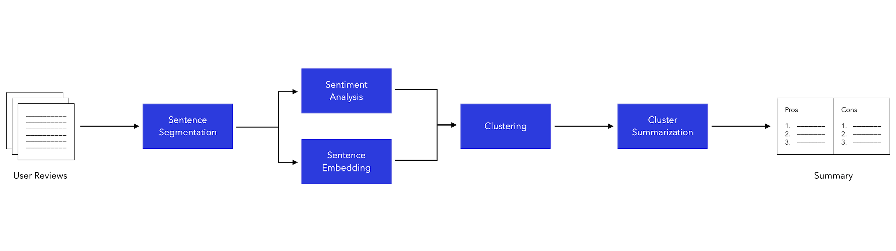

# User-Review-Understanding


## Project Goal

Help product owners to understand user needs, by grouping and counting the pros and cons identified in a large number of user reviews.


## Pipeline



1. **Input:** user reviews in `txt` or `csv` format, 
2. **Sentence segmentation:** Split each review into sentences using period
3. **Sentiment Analysis:** Identify if a sentence is positive or negative, and split by sentiment. Used [Textblob](https://textblob.readthedocs.io/en/dev/) 
4. **Sentence Embedding:** Embed sentences into vectors which capture the feature of sentences. Used [Infersent by Facebook](https://github.com/facebookresearch/InferSent)
5. **Clustering:** Clustered embeded sentences within positive and negative groups. Used [Agglomerative Clustering](https://scikit-learn.org/stable/modules/generated/sklearn.cluster.AgglomerativeClustering.html)
6. **Cluster Summarization:** To be finished
7. **Summary:** Clustered pros and cons with counts.


## Usage

```
Python3 main.py
```

## Results

**1. Good cases in Positive Feedbacks**

| Topic 1 - Love the filters                                   |
| :----------------------------------------------------------- |
| great filters great details i love snapchat so much but idk how to do streaks |
| although at times it randomly changes filters mostly your favorite one but nonetheless, its a really really great app😊😍 |
| snapchat does have cool and cute filters but most of the time when you click on some of these filters the app, once again, crashes |
| love it but try to add new filters but really i love it i love selfies with snap |

| Topic 2 - Takes good pictures                                |
| :----------------------------------------------------------- |
| i enjoy capturing pic                                        |
| snapchat captured amazing pictures                           |
| this includes pictures i took today, very important memories |
| love it better graphics than my real camera                  |
| i have somuch fun with thefilters and takes the best photos  |
| love the pictures it takes                                   |
| love the filters!! and that it saves your pictures           |

| Topic 3 - Good way to connect with friends                   |
| :----------------------------------------------------------- |
| it is a very good you can use filters talk to your best friends and others you can decorate your bitmoji and i just love the app if you are a major social media person you can take really nice pictures and really funny ones i'm post them on instagram but out of all these futures my favorite is |
| this app is wonderfull i have got lots of charms here and also able to chat with friends and getting new charms is very interesting here in snapchat |
| i love this app it is an awesome way to communicate has so many cool and fun features but i have one problem, my youtube my insta everything is working except for snapchat |
| i can share funny photos with my friends and capture the memories i love to look back at in the future this app is totally worth your time😊😊 |
| great app its realy fun u can talk to ur friends and u can have fun so i think this is a great way to connect with ur friends anywhere |
| snap chat is very amazing it plays a roll in my life it cheers me when i am down it makes me enjoy my phone time it is worth your time if you don't have this app you living in the past |
| this app is amazing it is very social you can talk to friends you can play games with friends and you can have a party together really fun if you want to follow me my name is chloe |
| his app is fantastic ! i love talking to all my friends and taking photos and making funny videos this app is very useful but on the other side it takes a lot of space on your phone |

**2. Bad Cases in Positive Feedbacks**

| Problem 1 - Failed to spit the long sentence                 |
| :----------------------------------------------------------- |
| when i have almost full bars on my phone and connected to a strong wifi i can not post honesly you should take out snapchat because it doesn't belong in this world it also kills battery so fast i was at 40 percent and now im at 5 |
| i'm having lots of bugs when trying to post on my story! if i record for more than 10 seconds and post it, it just keeps replaying the first 10 seconds over again until i stopped recording |
| i love the filters but when i want to play btimoji party 🎉 they tell me no conection but there is i tried this many times but till now it is still telling me no conection but even i saw that the internet 📶 part is green and my phone tell me conected to wifi |

| Problem 2 - Not specific                                     |
| :----------------------------------------------------------- |
| its a really good app but it freezez and glitches alot       |
| overall though it's a good app that does what it's supposed to do |
| it's a really good app but lots of drama                     |
| i don't like the updates but it's a good app                 |
| this is a really good app that has pitfalls and high points  |
| it may have its glitches but its a good app                  |
| its a better app but problem                                 |
| its a good app except for one small thing                    |
| its really good but i perfer more updates but irherwise its amazing! |
| would be great app however a load of shyte on android        |

| Problem 3 - Wrong sentiment classification                   |
| :----------------------------------------------------------- |
| great app just a little bugs where i can't send snaps to people every once and a while |
| fun app but it drains your battery way too much              |
| best app for texting and photos but needs some bugs fixed still |
| this is great app but lots of bugs in this version it gets freeze i have to open it again several times |
| this app makes me upset all beautiful filter have gone please reload that heratcrown filter 🙏 |

<style>
table {
    width:100%;
}
</style>
